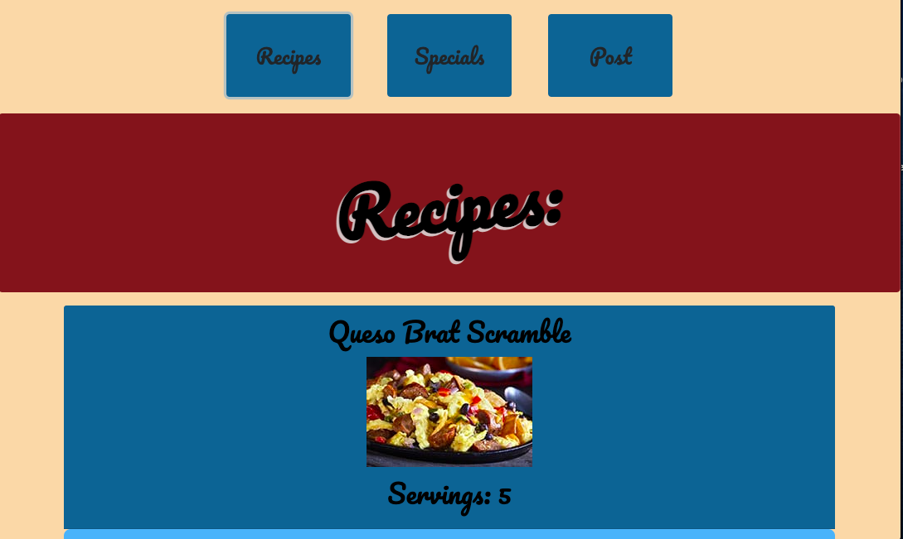

# Recipes

##  Repository: 
[Recipes](https://github.com/TBragg800/Recipes)

## Table of Contents
  [Description](#Description)

  [Installation](#Installation)

  [Usage](#Usage)

  [License](#License)

  [Questions](#Questions)
  
## Description
  This is an application created as a frontend api assessment. Using a series of GET and POST requests, the application displays a frontend of data consisting of specials and recipes. The application works in tandem with an API server (json-server). More information about querying the server can be found on the [json-server github page.](https://github.com/typicode/json-server)

## Installation
* Simply clone the repo locally.
* This project includes a API server (json-server) for you to use. To install, use the command: npm i.

## Usage
  This project includes a API server (json-server) for you to use. To run, use the command: npm run start:api. Once running, you can use the API endpoints listed in the following section from http://localhost:3001. More information about querying the server can be found on the [json-server github page.](https://github.com/typicode/json-server) 
  Finally, open the index.html file in the browser of your choice.

## License
  MIT License

Copyright (c) [2020] [Thomas Bragg]

Permission is hereby granted, free of charge, to any person obtaining a copy
of this software and associated documentation files (the "Software"), to deal
in the Software without restriction, including without limitation the rights
to use, copy, modify, merge, publish, distribute, sublicense, and/or sell
copies of the Software, and to permit persons to whom the Software is
furnished to do so, subject to the following conditions:

The above copyright notice and this permission notice shall be included in all
copies or substantial portions of the Software.

THE SOFTWARE IS PROVIDED "AS IS", WITHOUT WARRANTY OF ANY KIND, EXPRESS OR
IMPLIED, INCLUDING BUT NOT LIMITED TO THE WARRANTIES OF MERCHANTABILITY,
FITNESS FOR A PARTICULAR PURPOSE AND NONINFRINGEMENT. IN NO EVENT SHALL THE
AUTHORS OR COPYRIGHT HOLDERS BE LIABLE FOR ANY CLAIM, DAMAGES OR OTHER
LIABILITY, WHETHER IN AN ACTION OF CONTRACT, TORT OR OTHERWISE, ARISING FROM,
OUT OF OR IN CONNECTION WITH THE SOFTWARE OR THE USE OR OTHER DEALINGS IN THE
SOFTWARE.

## Questions
  All questions should be submitted to the email listed below. Please consult the GitHub profile or Repo for additional concerns. 
  Email: tbbragg83@gmail.com
  Github: [TBragg800](http://github.com/TBragg800)

## Screenshot of deployed application

